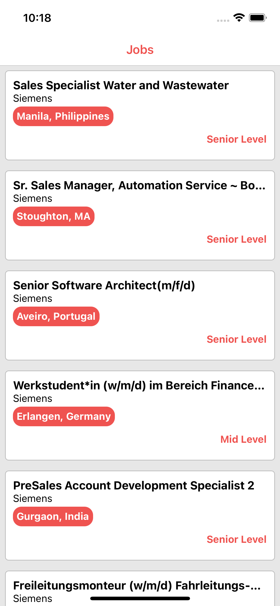
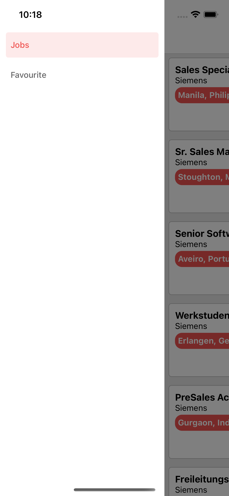
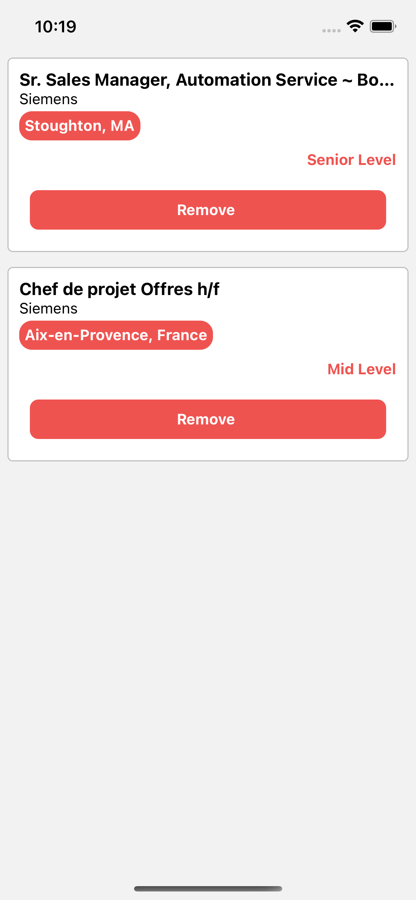

#   React-Native-Kodwork-App

##  Tools
*   React-Native
*   React-Redux-Toolkit
*   React-Navigation
*   Axios
*   React-NativeVector-Icons

##  Features
*   Fetches data from the api
*   Users can see jobs and job details
*   Users can add and remove favourite jobs

##  API
```
https://www.themuse.com/developers/api/v2
```

<div>
    
    
    
    
</div>

